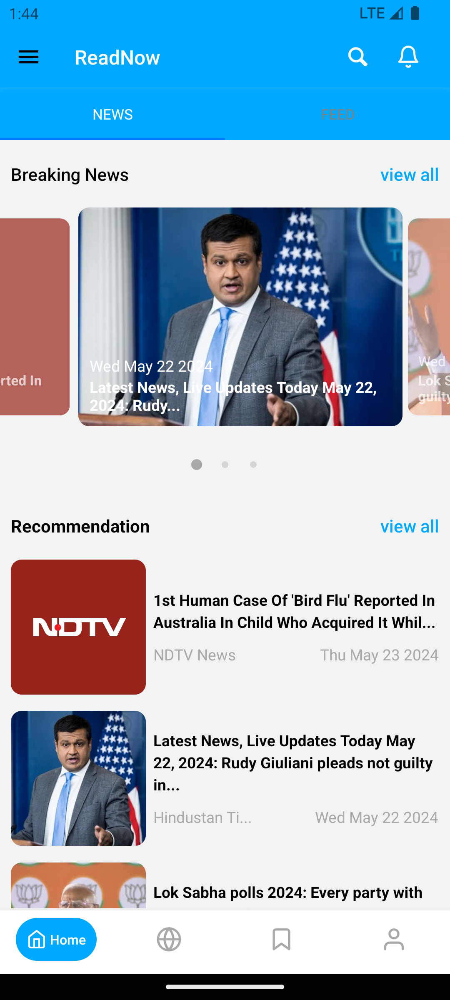
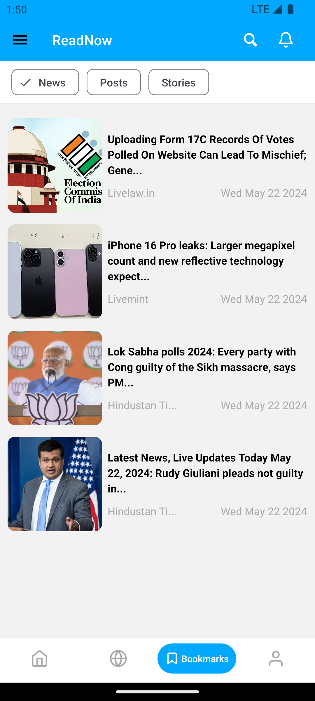
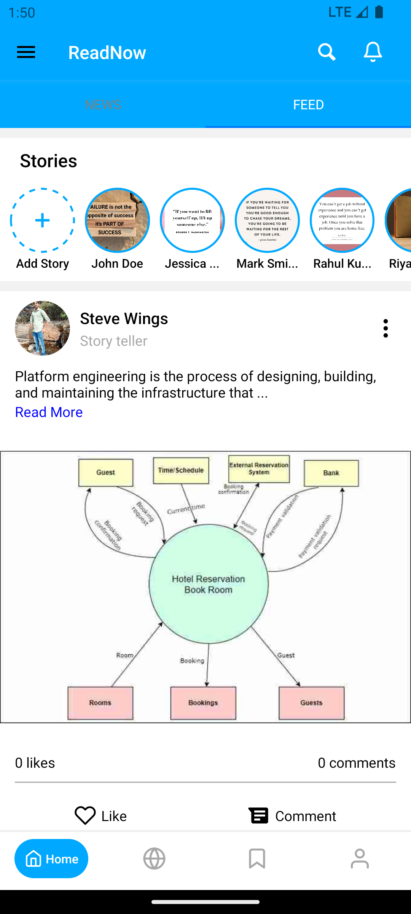
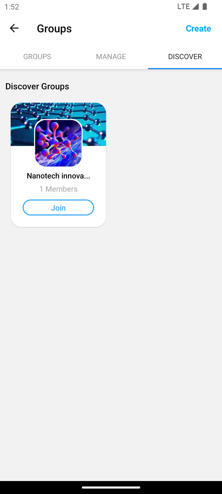
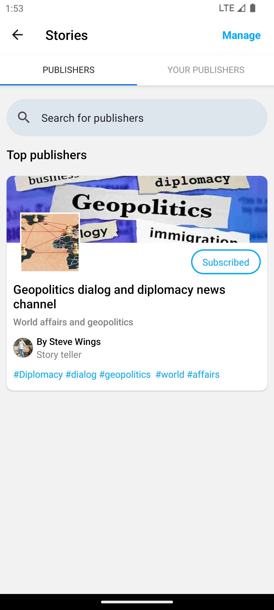

# READNOW - your reader's social media platform

## read anywhere, read anytime, readnow

### Description

READNOW is a social media platform for readers. It allows users to share their reading experiences, their thoughts, and recommendations with other users. Users can create a profile, follow other users, and create a reading list of books they want to read. They can also join groups and participate in discussions with other users. READNOW is a great way for readers to connect with others and discover new things to read.

### Features

- User authentication: Users can create an account and log in to the platform.
- Profile creation: Users can create a profile with information about themselves and their reading preferences.
- Follow users: Users can follow other users to see their reading activity and recommendations.
- Create AI-generated posts: Users can create posts about the books they are reading, and the platform will generate a summary of the book using AI.- Curated news: Users can read curated news articles about books and authors.
- Bookmarks: Users can bookmark posts, news and events they want to read and attend in the future.
- Groups: Users can join groups based on their reading interests and participate in discussions with other users.
- Events: Users can create and attend events related to books and reading.
- Notifications: Users receive notifications about new posts, news, events, and group activities.
- Search: Users can search for books, authors, and other users on the platform.
- Editorials: Users can read editorials about various topics and they can subscribe to their favorite publishers.

### Tech Stack

- Mobile app: React native, Redux, Material-UI
- Backend: Node.js, Express, MongoDB
- CMS: Strapi
- AI: Google palm AI

### Folder Structure

- `readnow-app`: React Native app
- `server`: Node.js server

### Client folder structure

- `api`: List of all the API calls exported as functions
- `assets`: Images, fonts, and other assets
- `redux`: Redux store, actions, and reducers
- `styles`: Global styles and colors
- `app`: Main app component
    - `events`: Events screen
    - `groups`: Groups screen
    - `stories`: Editorials screen
- `components`: Reusable components
    - `navigators`: Navigation components

### Server folder structure

- `apis`: The main node.js server
    - `controllers`: Controllers for each route
    - `models`: Mongoose models
    - `routes`: Express routes
    - `utils`: Utility functions
- `strapi2`: Strapi CMS

### Installation

#### Client

1. Clone the repository
2. Navigate to the `readnow-app` folder
3. Run `npm install` to install the dependencies
4. Run `npm expo start` to start the development server

#### Server

1. Navigate to the `server` folder
2. Navigate to the `strapi2/readnow-cms` folder
3. Run `npm install` to install the dependencies
4. Run `npm run strapi start` to start the Strapi server
5. Navigate back to the `apis` folder
6. Run `npm install` to install the dependencies
7. Run `node server` to start the Node.js server

### Screenshots

    

